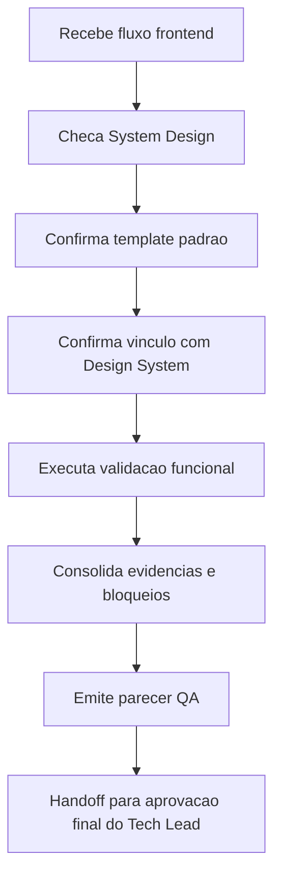

# Validacao QA de Fluxos Frontend — CR-07

## Identificacao

- Projeto ou produto: OBS Pro Bot
- Responsavel QA: QA Expert (IA)
- Data da validacao: 2026-03-22
- Escopo validado: CR-07 — validacao frontend em nivel documental e funcional basico com base em evidencias do repositorio
- Status: Reprovado

## Precondicao documental

- O System Design existe?: Sim
- O System Design usou `templates/system-design-template.md`?: Nao
- Em caso de nao, existe justificativa explicita?: Sim
- O System Design referencia o documento de Design System?: Nao (apenas pendencia registrada)
- Link ou referencia do System Design: `docs/system-design.md`
- Link ou referencia do Design System: `docs/design-system.md` (**nao encontrado no repositorio na data desta validacao**)
- Link ou referencia de Figma: Nao encontrado
- Link ou referencia de Storybook.js: Nao encontrado

## Checagem de coerencia documental

| Item verificado | Evidencia encontrada | Status | Observacoes |
|---|---|---|---|
| Vinculo entre System Design e Design System | `docs/system-design.md:95-109` registra "Pendente de publicacao formal" para Design System/Figma/Storybook | Nao conforme | Existe mencao de lacuna, sem referencia concreta a `docs/design-system.md` ou links ativos |
| Uso do template padrao de System Design | `docs/system-design.md` + `review/2026-03-22-0331-aprovacao-final-tech-lead.md:18-20` | Parcial | Documento existe e tem justificativa de excecao, mas nao evidencia preenchimento direto do template padrao |
| Referencia de Figma quando aplicavel | `docs/system-design.md:100` = "Pendente" | Nao conforme | Ausencia de link bloqueia validacao visual rastreavel |
| Referencia de Storybook.js quando aplicavel | `docs/system-design.md:101` = "Pendente" | Nao conforme | Ausencia de link bloqueia validacao de componentes |
| Evidencias visuais disponiveis | `docs/system-design.md:102` (somente mencao textual a telas Streamlit) | Parcial | Nao ha pacote versionado de capturas/video anexado em `review/` |

## Fluxos frontend validados

| Fluxo | Objetivo | Tipo de validacao | Resultado | Evidencias |
|---|---|---|---|---|
| Autenticacao na sidebar (entrar/sair/recuperacao por `sid`) | Confirmar existencia de fluxo de login e sessao na interface | Documental + inspeção funcional basica de codigo | Parcial | `dashboard.py:1490-1535` (login e query param `sid`), `dashboard.py:1525-1533` (UI login), `dashboard.py:1529` (sair) |
| Navegacao por abas principais (Painel, Minha Conta, Chaves API, Aporte, Saque, Extrato, Admin) | Confirmar mapeamento de fluxos frontend do escopo | Documental + inspeção funcional basica de codigo | Parcial | `dashboard.py:1571-1573` (tabs), `dashboard.py:1757+` (Administracao) |
| Fluxo Aporte | Confirmar formulario e acao de envio de comprovante | Documental + inspeção funcional basica de codigo | Parcial | `dashboard.py:1695-1700` |
| Fluxo Saque | Confirmar campos de solicitacao de saque | Documental + inspeção funcional basica de codigo | Parcial | `dashboard.py:1720-1726` |
| Fluxo Extrato | Confirmar existencia de tela de extrato | Documental + inspeção funcional basica de codigo | Parcial | `dashboard.py:1742` |
| Automacao E2E frontend (Cypress) | Confirmar execucao automatizada obrigatoria para frontend | Verificacao de evidencias no repositorio | Nao executado | Busca por artefatos Cypress retornou vazio (`find . -maxdepth 3 ... cypress ...` sem resultados); sem relatorios de execucao |

## Evidencias de execucao

- Capturas ou videos: nao encontrados nesta rodada.
- Logs ou relatarios: nao encontrados relatarios de execucao E2E/frontend em `review/`.
- Ambiente validado: repositorio local `/home/salesadriano/OBS`, branch `feature/p0-hardening-core` (inspecao documental/codigo).
- Dados de teste utilizados: nao aplicavel para esta validacao (nao houve execucao de teste funcional automatizado/manual navegando UI).
- Declaracao explicita de automacao: **validacao automatizada frontend nao foi executada nesta rodada; nao ha evidencias de Cypress executado**.

## Bloqueios e ressalvas

| Tipo | Descricao | Impacto | Acao recomendada | Owner |
|---|---|---|---|---|
| Bloqueio | `docs/design-system.md` nao encontrado no repositorio durante a validacao | Impede cumprir precondicao documental frontend (vinculo SD <-> DS) | Criar/publicar `docs/design-system.md` com versao, tokens/componentes e referencias rastreaveis | UX Expert |
| Bloqueio | Ausencia de referencias Figma e Storybook no System Design | Impede gate visual e de consistencia de componentes | Publicar links oficiais (ou justificar formalmente indisponibilidade) e atualizar `docs/system-design.md` | UX Expert + BA |
| Bloqueio | Ausencia de evidencias de Cypress (config, suite, relatorio de execucao) | Gate QA frontend automatizado nao atendido | Preparar ambiente Cypress (projeto e container, se aplicavel), implementar suite minima E2E e anexar relatorio | QA Expert + Senior Developer |
| Ressalva | System Design com justificativa de desvio de template, sem prova de estrutura integral do template padrao | Risco de lacuna de rastreabilidade entre artefatos | Complementar crosswalk objetivo com `templates/system-design-template.md` | Tech Lead + BA |

## Parecer final

- Resultado final: **Reprovado** para fechamento de QA frontend do CR-07 nesta rodada.
- Condicoes para aceite:
  1. Disponibilizar `docs/design-system.md` e vincular explicitamente em `docs/system-design.md`.
  2. Anexar evidencias visuais rastreaveis (Figma/Storybook ou equivalente formalmente aprovado).
  3. Executar validacao automatizada frontend com Cypress e registrar resultados.
  4. Reemitir este artefato com status atualizado apos nova rodada de evidencias.
- Necessidade de retorno ao Business Analyst: Sim (atualizar rastreabilidade documental e dependencias UX/QA no escopo formal).
- Necessidade de retorno ao UX Expert: Sim (publicacao de Design System e baseline visual).
- Necessidade de retorno ao Tech Lead: Sim (manter gate frontend reprovado ate convergencia das evidencias).
- Documento de aprovacao final do Tech Lead que deve receber esta validacao: `review/2026-03-22-0331-aprovacao-final-tech-lead.md`
- Trecho, link ou referencia desta validacao a ser reutilizado no fechamento final: `review/2026-03-22-2345-qa-validacao-frontend-cr07.md` (secoes **Precondicao documental**, **Bloqueios e ressalvas** e **Parecer final**), em conjunto com `review/2026-03-22-0328-revisao-consolidada-tech-lead.md`.

