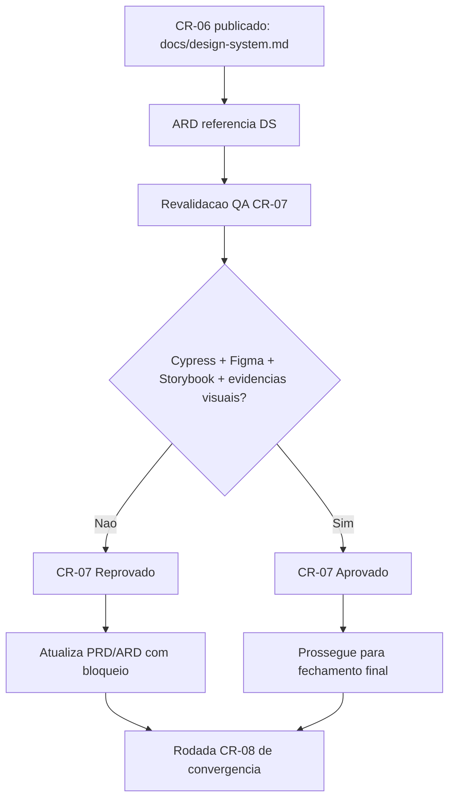

# Execucao CR-06 e CR-07 — consolidacao Tech Lead (frontend docs/QA)

## Contexto e objetivo

Consolidar a rodada CR-06/CR-07 na branch `feature/p0-hardening-core` apos:
- publicacao do baseline documental de Design System (`docs/design-system.md`) e vinculo no ARD;
- revalidacao QA frontend em template oficial, com verificacao dos bloqueios residuais.

Objetivo: registrar status real dos gates UX/QA frontend para suportar o proximo fechamento executivo do Tech Lead.

## Escopo tecnico e arquivos modificados

Arquivos impactados nesta consolidacao:
- `review/2026-03-22-2358-qa-validacao-frontend-cr07-revalidacao.md` (novo parecer QA frontend revalidado);
- `docs/declaracao-escopo-aplicacao.md` (status de gates G2/G3 e rastreabilidade cruzada ajustados ao estado atual);
- `docs/system-design.md` (dependencias QA/UX atualizadas com referencia explicita ao parecer CR-07 revalidado).

Escopo funcional avaliado:
- CR-06: baseline de Design System e coerencia ARD -> DS;
- CR-07: validacao QA frontend com criterio documental e de evidencias (Cypress, Figma, Storybook, pacote visual).

## ADR resumido

Decisao:
- manter **CR-06 como concluido parcial** (documentalmente atendido, governanca visual ainda incompleta);
- manter **CR-07 como reprovado** ate evidencia objetiva dos requisitos frontend obrigatorios.

Alternativas consideradas:
1. Aprovar CR-07 com ressalvas apenas por existir `docs/design-system.md`.
2. Manter reprovação enquanto faltarem evidências estruturais exigidas pela governanca.

Trade-off:
- A alternativa 1 acelera fechamento, mas fragiliza criterio de aceite definido (DEC-STR-08/09).
- A alternativa 2 preserva consistencia de gates e evita aceite sem prova verificavel de qualidade frontend.

Decisao adotada: alternativa 2.

## Evidencias de validacao

Evidencias reaproveitadas e validadas:
- `docs/design-system.md` publicado e referenciado em `docs/system-design.md`;
- `review/2026-03-22-2358-qa-validacao-frontend-cr07-revalidacao.md` com status final **Reprovado**;
- referencias de fechamento anterior:
  - `review/2026-03-22-0328-revisao-consolidada-tech-lead.md`;
  - `review/2026-03-22-0331-aprovacao-final-tech-lead.md`.

Bloqueios residuais registrados pelo QA na revalidacao:
1. ausencia de Cypress E2E (`cypress.config.*`, pasta `cypress/`, relatorios);
2. ausencia de referencia rastreavel de Figma;
3. ausencia de referencia rastreavel de Storybook;
4. ausencia de evidencias visuais reais versionadas (capturas/videos).

Validacao executada nesta consolidacao:
- sincronizacao documental de status em PRD/ARD para refletir o estado mais recente dos gates.

## Riscos, impacto e rollback

Riscos:
- liberar fechamento sem CR-07 atendido aumenta risco de regressao visual e quebra de governanca frontend;
- divergencia entre status em review e status em PRD/ARD reduz auditabilidade.

Impacto:
- melhora consistencia de rastreabilidade entre docs e parecer QA;
- mantém bloqueio frontend explicitamente visivel para a rodada de fechamento final.

Plano de rollback:
1. reverter ajustes de status em `docs/declaracao-escopo-aplicacao.md` e `docs/system-design.md`;
2. restaurar estado documental anterior caso o criterio de gate seja oficialmente alterado.

## Proximos passos recomendados

1. Executar CR-08 (nova convergencia de gates) com QA/UX/BA/DBA/SD.
2. Para destravar CR-07, entregar:
   - setup e suite minima Cypress com evidencia de execucao;
   - link oficial de Figma (ou excecao formal aprovada);
   - baseline Storybook (ou excecao formal aprovada);
   - pacote versionado de evidencias visuais (capturas/videos).
3. Publicar nova revisao consolidada Tech Lead e atualizar aprovacao final com estado dos gates.

## Diagrama (Mermaid)

