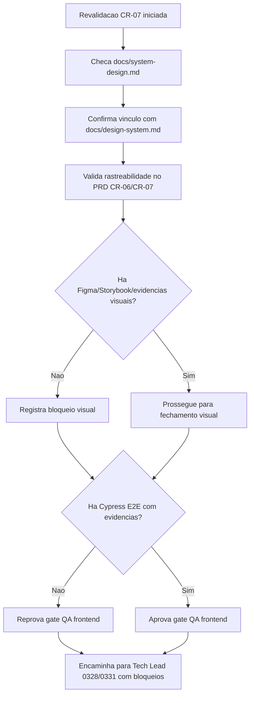

# Validacao QA de Fluxos Frontend — CR-07 (Revalidacao)

## Identificacao

- Projeto ou produto: OBS Pro Bot
- Responsavel QA: QA Expert (IA)
- Data da validacao: 2026-03-22
- Escopo validado: CR-07 — revalidacao frontend (gate documental + evidencias de automacao/frontend)
- Status: Reprovado

## Precondicao documental

- O System Design existe?: Sim
- O System Design usou `templates/system-design-template.md`?: Nao
- Em caso de nao, existe justificativa explicita?: Sim
- O System Design referencia o documento de Design System?: Sim
- Link ou referencia do System Design: `docs/system-design.md`
- Link ou referencia do Design System: `docs/design-system.md`
- Link ou referencia de Figma: Nao encontrado (pendente no ARD/DS)
- Link ou referencia de Storybook.js: Nao encontrado (pendente no ARD/DS)

## Checagem de coerencia documental

| Item verificado | Evidencia encontrada | Status | Observacoes |
|---|---|---|---|
| Vinculo entre System Design e Design System | `docs/system-design.md:95-110` referencia explicitamente `docs/design-system.md`; `docs/design-system.md` publicado | Conforme (parcial) | Vinculo SD<->DS atendido; governanca visual ainda incompleta |
| Uso do template padrao de System Design | `review/2026-03-22-0331-aprovacao-final-tech-lead.md:18-20` registra nao uso direto do template com justificativa explicita | Parcial | Excecao documentada, sem bloqueio novo |
| Referencia de Figma quando aplicavel | `docs/system-design.md:100` = pendente; `docs/design-system.md:88-93` = pendente | Nao conforme | Mantem ressalva/bloqueio visual |
| Referencia de Storybook.js quando aplicavel | `docs/system-design.md:101` = pendente; `docs/design-system.md:77-86` = pendente | Nao conforme | Mantem ressalva/bloqueio visual |
| Evidencias visuais disponiveis | `docs/design-system.md:71-76` indica ausencia de capturas reais versionadas | Nao conforme | Nao ha pacote visual rastreavel em `review/` |
| Rastreabilidade PRD de gates CR-06/CR-07 | `docs/declaracao-escopo-aplicacao.md:230-242,262` registra gates/documentos e estado de validacao | Conforme (documental) | PRD atualizado e coerente com gate frontend |

## Fluxos frontend validados

| Fluxo | Objetivo | Tipo de validacao | Resultado | Evidencias |
|---|---|---|---|---|
| Gate documental SD -> DS | Confirmar precondicao obrigatoria de frontend | Documental | Aprovado | `docs/system-design.md`, `docs/design-system.md` |
| Gate visual (Figma/Storybook/evidencias) | Confirmar trilha visual rastreavel | Documental | Reprovado | Ausencia de links/artefatos versionados |
| Automacao E2E frontend (Cypress) | Confirmar exigencia obrigatoria de E2E com Cypress | Verificacao de repositorio | Reprovado | Sem `cypress.config.*`, sem pasta `cypress/`, sem relatorios de execucao |
| Integracao com fechamento Tech Lead | Confirmar rastreabilidade para aceite final | Documental | Aprovado com ressalvas | `review/2026-03-22-0328-revisao-consolidada-tech-lead.md`, `review/2026-03-22-0331-aprovacao-final-tech-lead.md` |

## Evidencias de execucao

- Capturas ou videos: nao encontrados nesta rodada.
- Logs ou relatarios: nao encontrados relatarios de Cypress/E2E frontend nesta rodada.
- Ambiente validado: repositorio local `/home/salesadriano/OBS`, branch `feature/p0-hardening-core`.
- Dados de teste utilizados: nao aplicavel (revalidacao documental e de evidencias de automacao).
- Declaracao explicita de automacao: **nao ha evidencias de execucao Cypress no projeto/container nesta rodada**.

## Bloqueios e ressalvas

| Tipo | Descricao | Impacto | Acao recomendada | Owner |
|---|---|---|---|---|
| Bloqueio | Ausencia de automacao E2E com Cypress (configuracao, suite e relatorio) | Gate QA frontend obrigatorio nao atendido | Estruturar Cypress no projeto/container, implementar suite minima CR-07 e anexar evidencias de execucao | QA Expert + Senior Developer |
| Bloqueio | Ausencia de Figma e Storybook referenciados com links ativos | Impede validacao visual rastreavel e comparavel | Publicar links oficiais (ou justificativa formal aprovada) e atualizar ARD/DS | UX Expert + BA |
| Bloqueio | Ausencia de evidencias visuais reais versionadas (capturas/videos) | Reduz detectabilidade de regressao visual e consistencia de interface | Anexar pacote de evidencias visuais no repositorio/review | UX Expert + QA Expert |
| Ressalva | `docs/system-design.md` em formato proprio (nao preenchido diretamente no template) | Risco moderado de variacao documental futura | Manter crosswalk com `templates/system-design-template.md` nas proximas revisoes | Tech Lead + BA |

## Parecer final

- Resultado final: **Reprovado (status mantido em relacao a `review/2026-03-22-2345-qa-validacao-frontend-cr07.md`)**.
- Condicoes para aceite:
  1. Disponibilizar automacao E2E frontend com Cypress e evidencia de execucao.
  2. Publicar referencias rastreaveis de Figma e Storybook (ou excecao formal aprovada).
  3. Anexar evidencias visuais reais (capturas/videos) para validacao comparativa.
- Necessidade de retorno ao Business Analyst: Sim (ajustar plano de convergencia de gates CR-06/CR-07 e rastreabilidade).
- Necessidade de retorno ao UX Expert: Sim (fechamento de governanca visual: Figma/Storybook/evidencias).
- Necessidade de retorno ao Tech Lead: Sim (manter gate frontend bloqueado no fechamento formal).
- Documento de aprovacao final do Tech Lead que deve receber esta validacao: `review/2026-03-22-0331-aprovacao-final-tech-lead.md`.
- Trecho, link ou referencia desta validacao a ser reutilizado no fechamento final: este arquivo + consolidado `review/2026-03-22-0328-revisao-consolidada-tech-lead.md`.

