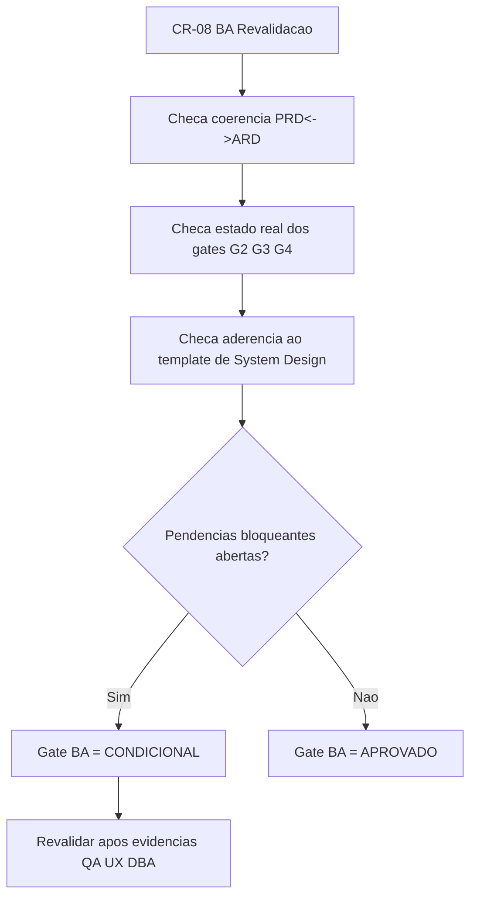

# Parecer BA — Revalidacao CR-08 (PRD↔ARD↔Gates)

## Contexto

- Branch avaliada: `feature/p0-hardening-core`.
- Artefatos base da revalidacao:
  - `review/2026-03-22-2358-qa-validacao-frontend-cr07-revalidacao.md`
  - `review/2026-03-22-2353-execucao-cr06-cr07-consolidacao-tech-lead.md`
  - `docs/declaracao-escopo-aplicacao.md` (PRD)
  - `docs/system-design.md` (ARD/System Design)
  - `docs/design-system.md`
- Estado de entrada informado:
  - CR-01..CR-06 executados;
  - CR-07 revalidado e **mantido reprovado** por falta de Cypress/Figma/Storybook/evidencias visuais.

## Decisao

**Status final do gate BA para CR-08: CONDICIONAL.**

Decisao objetiva:
1. **Coerencia PRD↔ARD↔gates:** mantida no essencial (G2 parcial e G3 reprovado estao refletidos nos documentos).
2. **Aderencia ao template de System Design:** **parcial com justificativa registrada**.  
   - `docs/system-design.md` cobre as secoes obrigatorias do template (componentes, integracoes, implantacao, dimensionamento, rastreabilidade, referencia ao Design System).
   - Nao ha evidencia de preenchimento direto de `templates/system-design-template.md`; ha justificativa explicita em `review/2026-03-22-0331-aprovacao-final-tech-lead.md`.
3. **Gate BA nao e “Aprovado”** porque permanecem pendencias bloqueantes interdisciplinares (QA frontend, governanca visual UX e handoff DBA) que impactam fechamento formal.

## Impacto

- Positivo:
  - Mantem rastreabilidade entre PRD, ARD e validacoes de gate.
  - Evita aceite BA falso-positivo enquanto G3/G4 seguem sem evidencias completas de fechamento.
- Negativo:
  - Release formal segue bloqueado em cascata ate fechamento de QA frontend e governanca visual.
  - Permanece risco de divergencia visual/funcional sem Cypress + baseline visual oficial.

## Pendencias

| ID | Divergencia aberta | Origem | Impacto | Owner | Status |
|---|---|---|---|---|---|
| D-01 | CR-07 frontend reprovado por ausencia de Cypress + evidencias de execucao | QA x implementacao | Gate G3 permanece bloqueado | QA Expert + Senior Developer | Aberta |
| D-02 | Ausencia de referencia oficial Figma | UX/Design System | Sem trilha visual de proposta validavel | UX Expert | Aberta |
| D-03 | Ausencia de Storybook versionado | UX/implementacao | Sem catalogo de componentes/estados testaveis | UX Expert + Senior Developer | Aberta |
| D-04 | Ausencia de evidencias visuais reais versionadas | UX/QA | Reduz comparabilidade e auditoria visual | UX Expert + QA Expert | Aberta |
| D-05 | ARD nao preenchido diretamente no template padrao (com excecao justificada) | Governanca documental | Risco de variacao estrutural futura | BA + Tech Lead | Aberta (com justificativa) |
| D-06 | Handoff DBA de dimensionamento/expansao de banco nao anexado | ARD/DBA | G4 sem base formal de capacidade | DBA | Aberta |

## Recomendacoes

1. **Manter gate BA em Condicional** ate fechamento minimo de D-01..D-04 e plano DBA (D-06).
2. Formalizar no proximo ciclo uma **crosswalk matrix** explicita `system-design-template.md` ↔ `docs/system-design.md` (ou migracao integral para o template padrao).
3. Reexecutar CR-08 apos anexos objetivos:
   - relatorio Cypress (com execucao reproduzivel),
   - links oficiais Figma/Storybook (ou excecao formal aprovada),
   - pacote visual versionado (capturas/videos),
   - handoff DBA incorporado no ARD.
4. Encaminhar este parecer como dependencia de fechamento no fluxo do Tech Lead.

