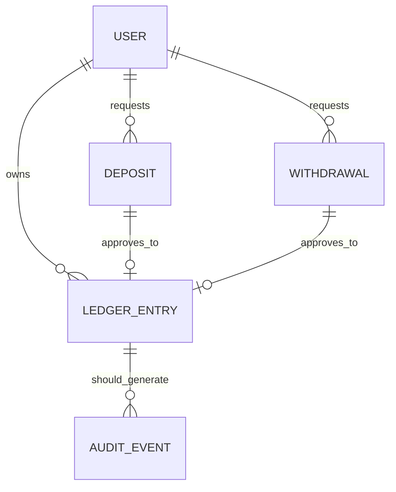

# Parecer DBA — CR-08 Revalidacao de Gate (dados e capacidade)

## 1) Contexto e escopo

- CR avaliado: **CR-08 — revalidacao de gates e fechamento tecnico**.
- Branch avaliada: `feature/p0-hardening-core`.
- Foco DBA nesta rodada:
  1. integridade transacional financeira (P0);
  2. consistencia documental entre PRD/ARD/persistencia;
  3. governanca de dados (auditoria, recuperacao, capacidade);
  4. handoff formal do plano de dimensionamento/expansao ao BA.

## 2) Decisao de gate DBA

**Status final do gate DBA CR-08: APROVADO COM RESSALVAS (mantido).**

Motivo: o escopo P0 de integridade transacional permanece atendido, mas continuam abertas pendencias P1 criticas para governanca plena de dados:
- trilha financeira **append-only** completa;
- backup/restore **executavel e testado** com RPO/RTO;
- validacao operacional do plano de capacidade em carga real.

## 3) Evidencias objetivas (codigo, testes e docs)

### 3.1 Persistencia e atomicidade

| Evidencia | Referencia | Resultado |
|---|---|---|
| SQLite em WAL + timeout + busy_timeout | `dashboard.py:124-130` | Reduz contencao e melhora robustez de lock |
| Revisao de deposito atomica (`BEGIN IMMEDIATE`, update + ledger no mesmo commit, rollback em erro) | `dashboard.py:481-509` | Atende requisito de integridade transacional P0 |
| Criacao de saque com validacao de saldo dentro da secao critica | `dashboard.py:517-543` | Mitiga race basica de overspend |
| Revisao de saque atomica com rollback | `dashboard.py:562-583` | Mantem consistencia status x ledger |
| Modelo atual de ledger | `dashboard.py:196-200` | Sem campos append-only de auditoria avancada (actor/correlation/before-after) |

### 3.2 Evidencias de testes automatizados no repositorio

| Evidencia | Referencia | Resultado |
|---|---|---|
| Rollback atomico em deposito quando lancamento falha | `tests/test_p0_hardening.py:83-107` | Cobertura P0 presente |
| Rollback atomico em saque quando lancamento falha | `tests/test_p0_hardening.py:110-135` | Cobertura P0 presente |
| Validacao de saldo dentro da secao critica | `tests/test_p0_hardening.py:138-148` | Cobertura P0 presente |
| Concorrencia minima (2 threads, 1 persistencia) | `tests/test_p0_hardening.py:242-274` | Evidencia minima de contenção |

### 3.3 Evidencias documentais de status e pendencias

| Evidencia | Referencia | Leitura |
|---|---|---|
| Gate DBA previamente consolidado com ressalvas | `review/2026-03-22-0404-execucao-cr02-cr05-hardening-core.md:26` | Consistente com estado atual |
| Pendencia de handoff DBA no ARD (estado anterior) | `docs/system-design.md` (secao de capacidade) | Necessitava atualizacao com plano formal |

## 4) Decisoes de modelagem e trade-offs

1. **Manter SQLite + WAL no curto prazo**
   - Trade-off: menor custo operacional e simplicidade vs limite de escala/concorrencia.
2. **Centralizar saldo no `ledger`**
   - Trade-off: reconciliacao mais clara vs necessidade de auditoria append-only formal para investigacao.
3. **Transacao explicita em operacoes financeiras criticas**
   - Trade-off: maior seguranca de consistencia vs throughput de escrita mais restrito sob lock.

## 5) Plano de migracao e rollback (estado atual + proxima onda)

### 5.1 Nesta revalidacao (CR-08)
- **Mudanca de schema executada:** nao.
- **Rollback tecnico:** nao aplicavel para schema (somente rollback documental via git).

### 5.2 Proxima onda de dados (P1)

1. **Append-only audit trail**
   - Migracao forward:
     - criar tabela `audit_events` append-only;
     - backfill minimo de correlacao para eventos novos (sem reescrita de historico antigo).
   - Rollback:
     - manter tabela inativa por feature flag;
     - rollback de aplicacao sem drop imediato da tabela.

2. **Backup/restore executavel**
   - Forward:
     - runbook versionado com backup consistente (WAL checkpoint + copia + checksum);
     - rotina de restore em base limpa com reconciliacao financeira.
   - Rollback:
     - retornar para rotina manual anterior, preservando artifacts de teste.

3. **Capacidade e expansao para PostgreSQL**
   - Forward:
     - gatilhos objetivos de migracao (latencia, lock, tamanho DB, TPS);
     - dry-run de migracao em homologacao.
   - Rollback:
     - blue/green de persistencia com janela de fallback para SQLite (somente leitura durante corte, se necessario).

## 6) Plano de dimensionamento e expansao do banco (handoff formal ao BA)

### 6.1 Premissas
- Carga inicial: dezenas de usuarios simultaneos; ciclo de bot de ~15s.
- Crescimento esperado: aumento continuo de `bot_trades` e `ledger`.
- Padrao de acesso: leitura frequente de dashboard e escrita transacional financeira/eventos de bot.

### 6.2 Metas e limites operacionais (SQLite)
- p95 de escrita financeira (deposito/saque/revisao): **<= 250 ms**.
- Erro por lock/timeouts: **< 1% por janela de 15 min**.
- Tamanho de DB para alerta: **>= 4 GB** (warning), **>= 8 GB** (critico).
- Crescimento diario sustentado de `ledger`/`bot_trades`: monitorar e revisar retention quando > 5% semana.

### 6.3 Gatilhos de expansao SQLite -> PostgreSQL
- 2 ou mais gatilhos por 7 dias consecutivos:
  1. p95 de escrita > 250 ms;
  2. lock timeout >= 1%;
  3. DB >= 8 GB;
  4. necessidade de multiplas replicas de escrita.

### 6.4 Estrategia de expansao
- Curto prazo: otimizar indices e housekeeping em SQLite.
- Medio prazo: migrar transacional para PostgreSQL (ledger/deposit/withdraw/session).
- Longo prazo: separar historico analitico de `bot_trades` (retencao/arquivamento).

### 6.5 Handoff formal ao Business Analyst

**Para consolidacao no System Design (`docs/system-design.md`):**
- incorporar este parecer como fonte oficial do plano DBA para CR-08;
- registrar premissas, limites, gatilhos e estrategia de expansao definidos na secao 6;
- manter no ARD as pendencias P1 remanescentes (append-only e backup/restore testado) como condicoes para aceite pleno.

## 7) Riscos de performance e mitigacoes

| Risco | Impacto | Mitigacao | Owner |
|---|---|---|---|
| Contencao de escrita no SQLite | Alto | monitorar lock/p95 + gatilho de migracao para PostgreSQL | DBA + Tech Lead |
| Crescimento de historico sem politica de retention | Medio/Alto | rotina de arquivamento e estrategia de consulta por janela | DBA |
| Concorrencia acima do perfil atual testado | Alto | ampliar testes de concorrencia (multi-thread/multi-processo) | QA + DBA |

## 8) Checklist de seguranca de dados

- [x] FK habilitada (`PRAGMA foreign_keys = ON`).
- [x] WAL habilitado para resiliencia operacional basica.
- [x] Operacoes financeiras criticas com transacao explicita + rollback.
- [ ] Trilha append-only com actor/correlation_id/before-after.
- [ ] Backup/restore com teste periodico, RPO/RTO e reconciliacao registrados.
- [ ] Politica formal de acesso/mascaramento para dados sensiveis (API keys, dados financeiros).

## 9) Divergencias e recomendacoes formais ao Tech Lead

| Divergencia | Origem | Impacto | Recomendacao |
|---|---|---|---|
| Ausencia de trilha append-only financeira completa | Requisito de governanca x persistencia implementada | Investigacao/auditoria limitada | Priorizar CR-09 com schema e validacao QA/DBA |
| Backup/restore sem evidencia executavel recorrente | Operacao x resiliencia | Risco de indisponibilidade/perda em incidente | Priorizar CR-10 com runbook testado e KPI de RPO/RTO |
| Capacidade historicamente descritiva sem metas operacionais | ARD x operacao | Escala reativa e tardia | Adotar gatilhos da secao 6 no monitoramento e no ARD |

## 10) Condicoes objetivas para aceite pleno do gate DBA

1. Implementar trilha append-only financeira com campos auditaveis (actor, correlation_id, before/after, timestamp, origem).
2. Executar e evidenciar rotina de backup/restore com reconciliacao e metas RPO/RTO atendidas.
3. Validar em carga os gatilhos de capacidade e plano de migracao SQLite -> PostgreSQL.
4. Revalidar gate DBA com evidencias automatizadas anexadas em `review/`.

---

**Conclusao DBA (CR-08):** o status permanece **Aprovado com ressalvas**; ha convergencia no P0 transacional, mas o aceite pleno depende da conclusao objetiva das pendencias P1 acima.
